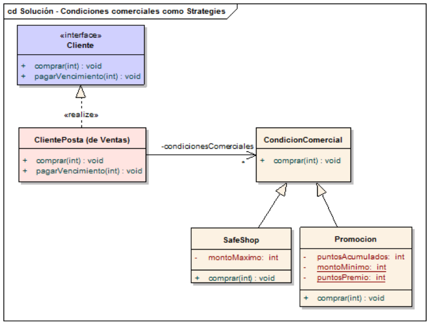

# Ejercicio Clientes de una Tarjeta de crédito (continuación)

Venimos de [este branch](https://github.com/wollok/clientesTarjeta/tree/01-if), donde nuestra primera versión fue utilizar condicionales para incorporar las condiciones comerciales safe shop y promoción. Vamos a explorar otras alternativas.

## Tener una colección de condiciones comerciales

Para esto necesitamos entender que queremos separar dos conceptos que no son intrínsecos:
El cliente en sí (representado por la clase ClientePosta)
Las condiciones comerciales del cliente, que pueden ser muchas y además las quiero combinar

Algo así:



¿Qué tipo de colección voy a usar para las condiciones comerciales? Y.. no me da lo mismo si sumo los puntos y resulta que salta la alarma de Safe Shop. Como además no quiero tener dos veces a la condición comercial Safe Shop, entonces el ClientePosta usará una **lista de condiciones comerciales**.

Esta alternativa toma como propias las ventajas de las soluciones anteriores:

* Separa el comportamiento específico de cada condición comercial
* Es fácil agregar o sacar una condición comercial dinámicamente: basta con actualizar la lista de condiciones comerciales del Cliente

El código de ClientePosta cambia a:

```js
class Cliente {

	var property deuda = 0
	const property condicionesComerciales = []
	// PROMOCION
	var property puntosPromocion = 0

	method agregarCondicionComercial(condicion) {
		condicionesComerciales.add(condicion)	
	}
	
	method comprar(monto) {
		condicionesComerciales.forEach {
			condicion => condicion.comprar(monto, self)
		}
		
		// Comprar propiamente dicho
		deuda = deuda + monto
	}

	method sumarPromocion(puntos) {
		puntosPromocion += puntos
	}
}

object safeShop {
	var property montoMaximoSafeShop = 50

	method comprar(monto, cliente) {
		if (monto > montoMaximoSafeShop) {
			error.throwWithMessage("Debe comprar por menos de " + montoMaximoSafeShop)
		}
	}	
}

object promocion {
	
	method comprar(monto, cliente) {
		if (monto > 20) {
			cliente.sumarPromocion(15)
		}
	}
}
```

La desventaja es que tengo que asegurarme de cumplir el orden de las condiciones comerciales para que no tenga consecuencias indeseadas: no me da lo mismo que esté primero safe shop y después promoción que viceversa...

## Instanciar un cliente en el test

El test que necesita de un cliente con safe shop y otro que tenga ambas condiciones comerciales necesita un fixture o un lugar donde poder inicializar diferentes juegos de datos:

```js
describe "tests de clientes" {

	const clienteSafeShop = new Cliente()
	const clienteSafePromo = new Cliente() 

	fixture {
		clienteSafeShop.agregarCondicionComercial(safeShop)
		clienteSafePromo.agregarCondicionComercial(safeShop)
		clienteSafePromo.agregarCondicionComercial(promocion)
	}
```

## La próxima variante

Seguimos con [03-decorators](https://github.com/wollok/clientesTarjeta/tree/03-decorators)

