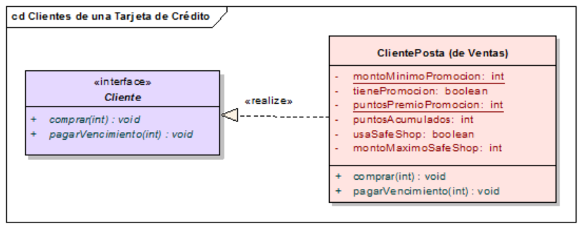
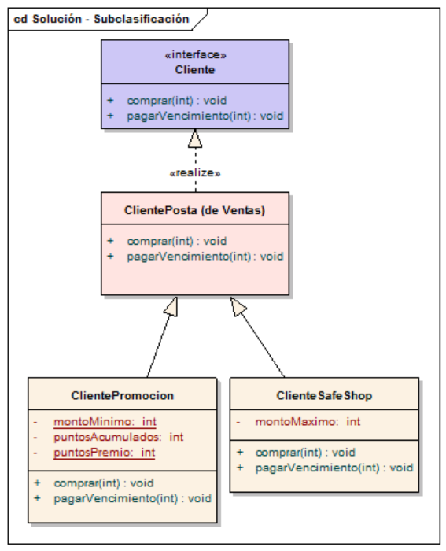

# Ejercicio Clientes de una Tarjeta de crédito

Pertenecemos a la gerencia de Condiciones Comerciales de una empresa emisora de una Tarjeta de Crédito. La gerencia de Ventas nos provee una interfaz Cliente, cuyos contratos son:

* comprar(int monto)
* pagarVencimiento(int monto)

Se pide contemplar los siguientes requerimientos:

* algunos clientes adheridos a una promoción suman 15 puntos por cada compra mayor a $ 50.
* además, algunos clientes contrataron el sistema 'Safe Shop', que bloquea compras de la tarjeta mayores a un monto que el cliente fija.

## Sobre el dominio

Tenemos dos sectores dentro de la empresa de tarjetas de crédito: 

* Ventas
* Condiciones Comerciales

> ¿Qué responsabilidades cumplen cada una? 

Si bien la empresa tiene vendedores que son quienes interactúan en muchos casos con los clientes (para ofrecer nuevos servicios), en algunas empresas existe un sector que determina restricciones o acuerdos que los vendedores deben cumplir, que son las “condiciones comerciales”.  
Ejemplos:

* Todos los clientes del exterior tienen un descuento del 20% por pago en efectivo
* Los clientes minoristas sólo pueden pagar en efectivo
* Se acepta que los clientes Rabufetti y Filipetto paguen con cheques a 30, 60 y 90 días 

Vemos que Cliente intersecta el negocio de ambos sectores (Ventas y Condiciones Comerciales). Ahora veremos cómo atacar estos requerimientos.

## Primera solución: condicionales

Si priorizamos la **simplicidad** como atributo de calidad... bueno, lo más sencillo es modificar la clase Cliente:



* Necesitamos saber si el cliente está adherido a la promoción, cuál es el monto mínimo y los puntos que se le otorgan
* Necesitamos conocer si el cliente está adherido al sistema Safe Shop y cuál es el monto máximo de compra

Dado que no tenemos interfaces explícitas en Wollok trabajaremos directamente sobre la clase Cliente:

```js
class Cliente {
	var property deuda = 0
	
	// SAFE SHOP
	var property tieneSafeShop = false
	var property montoMaximoSafeShop = 50
	
	// PROMOCION
	var property tienePromocion = false
	var property puntosPromocion = 0

	method comprar(monto) {
		// SAFE SHOP	
		if (tieneSafeShop && monto > montoMaximoSafeShop) {
			error.throwWithMessage("Debe comprar por menos de " + montoMaximoSafeShop)
		}
		
		// Comprar propiamente dicho
		deuda = deuda + monto
		
		// PROMOCION
		if (tienePromocion && monto > 20) {
			puntosPromocion = puntosPromocion + 15
		}
	}
}
```

`tieneSafeShop` puede ser un atributo o un método calculado. Generamos el test con diferentes casos de prueba:

```js
describe "tests de clientes" {
	const clienteSafeShop = new Cliente(tieneSafeShop = true)
	const clienteSafePromo = new Cliente(tienePromocion = true, tieneSafeShop = true) 
```

Ok, esta solución tiene algunos inconvenientes:

* “Ensucia” la lógica del método comprar() del cliente
* Agrega atributos que no todos los clientes necesitan: si el cliente no se adhiere al sistema Safe shop no necesita definir el monto máximo de la compra. El problema no es guardar una referencia de más, sino que el que lee la clase Cliente puede confundirse pensando que esa variable es necesaria para todos los casos.

Por otra parte es fácil hacer que el cliente entre y salga de la promoción de puntos o habilite/deshabilite la opción Safe Shop. Como los requerimientos son simples de codificar, agregar condicionales (ifs) es una opción más que posible. Si en alguna otra parte necesitáramos hacer algo para los adheridos a safe shop o promoción, o bien si aparecieran muchas más condiciones comerciales quizás podría empezar a molestarme la cantidad de líneas agregadas en esos ifs.

## ¿Subclasificar?

Otra opción podría ser subclasificar el concepto ClientePosta. Tenemos así dos subclases: ClienteSafeShop y ClientePromocion.



Esta alternativa separa claramente las responsabilidades de cada condición comercial. Ya no se ensucia al ClientePosta, sino que cada subclase delega en la superclase el comportamiento default del comprar y además hace su propio agregado. Parece una trivialidad pero no lo es, el atributo montoMaximoSafeShop pasa a llamarse montoMaximo a secas.

No obstante esta opción presenta una clara desventaja: no sólo es complicado hacer que un cliente posta habilite/deshabilite el servicio de Safe Shop, **esta solución no permite que coexistan un cliente en promoción que también tenga safe shop**, y es el motivo que lo convierte en la solución menos deseable de todas.

Seguimos en el branch: 02-strategies