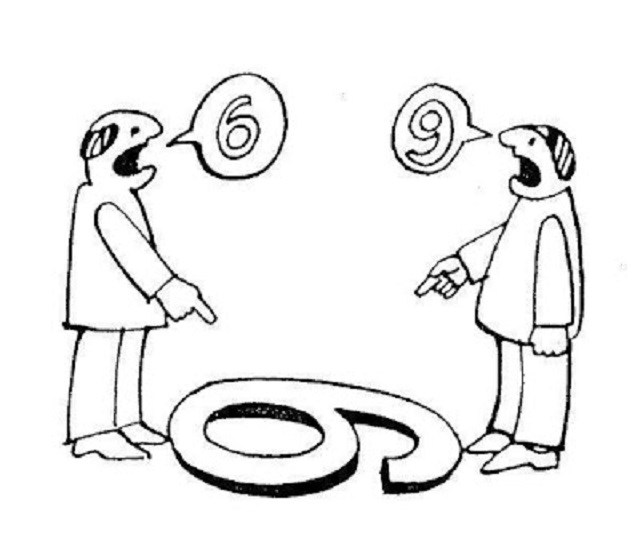
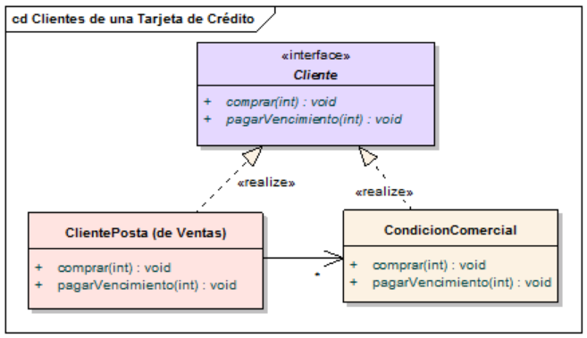
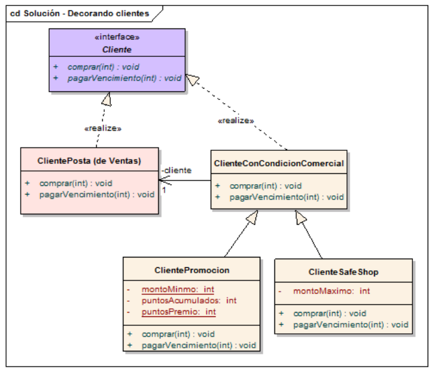
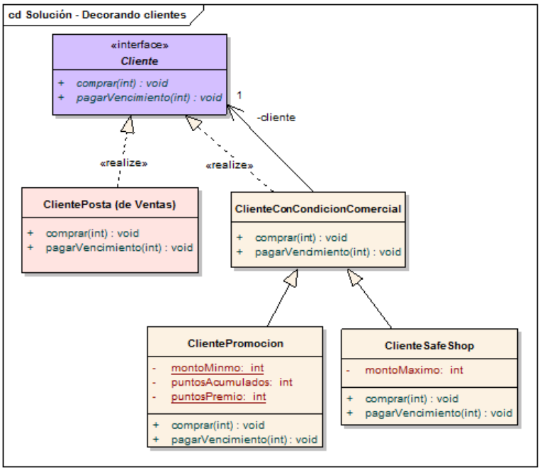
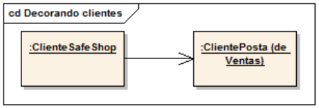
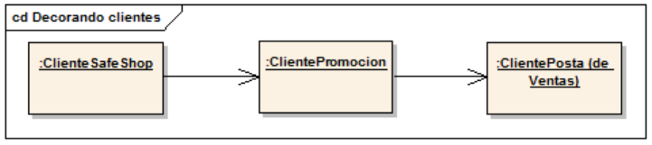
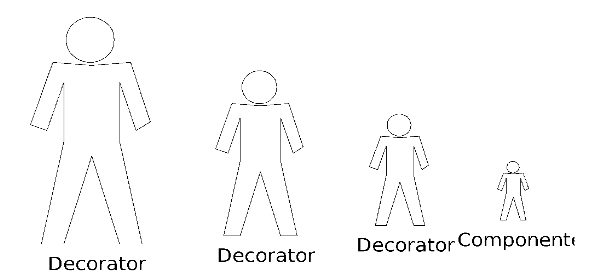
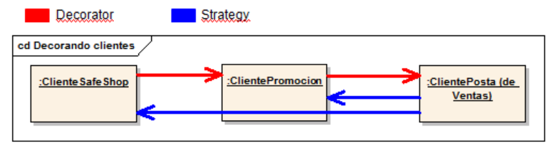
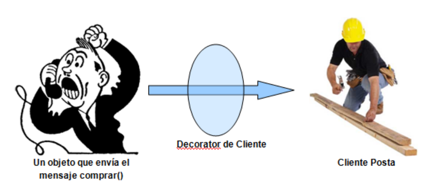
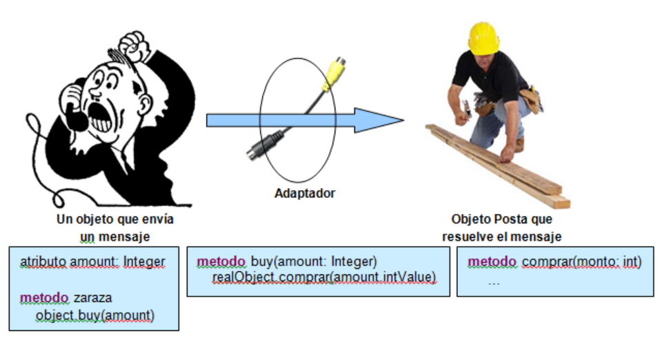

# Ejercicio Clientes de una Tarjeta de crédito (continuación)

Venimos de [este branch](https://github.com/wollok/clientesTarjeta/tree/02-strategy), donde trabajamos cada condición comercial como un strategy.

## Cambiando el ángulo de la información



Revisemos el código del Cliente nuevamente:

```js
method comprar(monto) {
    condicionesComerciales.forEach {
        condicion => condicion.comprar(monto, self)
    }
```

Fíjense que primero enviamos el mensaje comprar() a las condiciones comerciales porque la opción Safe Shop hace que yo tenga que cortar la compra. Si quisiéramos que no importe el orden en el que agrego las condiciones comerciales, entonces tendría que tener dos listas, una de condiciones a ejecutar previas a la compra, y otra de condiciones a ejecutar posterior a la compra.

```js
method comprar(monto) {
    condicionesComercialesPrevias.forEach {
        condicion => condicion.comprar(monto, self)
    }
    ... comprar propio del cliente ...
    condicionesComercialesPosteriores.forEach {
        condicion => condicion.comprar(monto, self)
    }
```

Por otra parte, las condiciones comerciales definen un comportamiento polimórfico con respecto al ClientePosta (a ambos les puedo enviar un mensaje comprar() salvando la diferente cantidad de parámetros). 

El ClientePosta y el ClienteSafeShop / ClientePromocion son polimórficos en el contexto en que el cliente compra, entonces yo podría decirle a la CondicionComercial que implemente la interfaz Cliente:



Pero ya no estamos modelando una condición comercial, sino un Cliente con alguna condición comercial. 

¿Y si además cambiamos la referencia? O sea: que el cliente con condición comercial sea quien conozca al ClientePosta:



Este modelo así tiene una contra importante que ya vimos en la solución 2: no me permite que un cliente en Promoción se asocie al sistema Safe Shop. Pero podemos ajustar eso fácilmente: el ClienteConCondicionComercial puede conocer un Cliente en lugar de conocer al ClientePosta:



Y lo que estamos haciendo con el cliente es **decorándolo** (vamos agregando comportamiento cuando compra).

## Solución en Wollok

Vemos la nueva solución, que aprovecha los constructores heredados de Wollok:

```js
class Cliente {
	var property deuda = 0
	// PROMOCION
	var property puntosPromocion = 0

	method comprar(monto) {
		deuda = deuda + monto
	}

	method sumarPromocion(puntos) {
		puntosPromocion += puntos
	}
}

class ClienteDecorador {
	const cliente
	
	constructor(_cliente) {
		cliente = _cliente
	}
	
	method comprar(monto)
	method sumarPromocion(puntos) { cliente.sumarPromocion(puntos) }
}

class ClienteSafeShop inherits ClienteDecorador {
	var property montoMaximoSafeShop = 50

	override method comprar(monto) {
		if (monto > montoMaximoSafeShop) {
			error.throwWithMessage("Debe comprar por menos de " + montoMaximoSafeShop)
		}
		cliente.comprar(monto)
	}	
}

class ClientePromocion inherits ClienteDecorador {
	override method comprar(monto) {
		cliente.comprar(monto)
		if (monto > 20) {
			cliente.sumarPromocion(15)
		}
	}
}
```

El cliente es un **delegado**: no sabemos si será el ClientePosta o alguno de los clientes que tengan condiciones comerciales.

## Consecuencias

Sobre la solución podemos decir:

* El comprar de Safe Shop primero valida que no exceda el máximo de la compra y después delega al cliente, mientras que el ClientePromocion delega primero y después acumula los puntos, lo cual permite que la regla de negocio comprar falle y no se acumulen los puntos erróneamente. Esto es una ventaja respecto a la solución anterior: podemos agregar comportamiento antes o después de la compra.
* Una consecuencia es que esta solución no requiere un orden específico de las condiciones comerciales: puedo tener primero la promoción y después el safe shop o al revés y la solución sigue funcionando correctamente (no suma puntos si no corresponde, primero se delega el control al safe shop).
* El ClientePosta (de Ventas) no se ve afectado. Esto puede verse como una ventaja, ya que estoy agregando comportamiento a un objeto sin cambiarle una línea de código.
* Cada condición comercial es un decorador del cliente en el sentido en que le agrega comportamiento. El cliente es el decorado o componente.
* Un cliente con Safe Shop se representa así:



*  Un cliente con Safe Shop y Promoción se representa así:



* Una desventaja de esta solución es que me obliga a respetar la misma interfaz que el objeto decorado. En el caso del método sumarPromocion() hay que implementarlo delegando al cliente posta la resolución, y lo mismo nos pasaría si quisiéramos tener polimorfismo para averiguar los puntos de promoción acumulados o la deuda de nuestro cliente sin discriminar si es decorador o decorado

Entonces para usar esta idea, lo que conviene es que el Componente tenga una interfaz chica (reducida en cantidad de métodos a implementar):



Por eso es común tener una clase abstracta padre de todos los decorators que delegue al objeto decorado los mensajes que no queremos cambiar (decorar).

### Decorator vs. Strategy: manejo de la identidad del cliente

Tanto la técnica de decoración como la del Strategy nos permite agregar comportamiento en forma dinámica. La diferencia es que el Strategy trabaja desde el cliente hacia adentro y que el Decorator (así es el nombre del pattern) trabaja agregando “pieles” desde el objeto hacia fuera:



Esto trae consecuencias importantes: en mi aplicación tengo que instanciar Clientes decorados en lugar del ClientePosta, mientras que con la solución 3) el cliente conservaba su identidad (seguía siendo él).

Entonces hay que tener cuidado cuando pregunto si dos clientes son los mismos (el decorado no es el componente, no puedo comparar nunca por identidad y tener cuidado en el caso de la igualdad).

## Instanciación de decoradores

Vemos cómo se instancian los clientes en el test:

```js
const cliente1 = new Cliente()
const cliente2 = new Cliente()
const clienteSafeShop = new ClienteSafeShop(cliente1)
const clienteSafePromo = new ClientePromocion(new ClienteSafeShop(cliente2)) 
```

guardamos una referencia a cliente1 y cliente2 simplemente para poder calcular los puntos de promoción y la deuda sin necesidad de escribir un método _secretario_ en la clase abstracta decoradora:

```js
	test "cliente con safe shop compra por poco bien" {
		clienteSafeShop.comprar(10)
		assert.equals(10, cliente1.deuda()) // si pedimos clienteSafeShop.deuda()
                                            // tiraría error, no entiende el mensaje
	}
```

## Agregar o sacar decoradores

"Es fácil agregar o eliminar responsabilidades" dice Gamma, pero en realidad desdecorar el componente requiere conocer al decorator específico (la clase), por eso en general se suele almacenar las referencias al componente original (el ClientePosta) y agregarle en runtime los decoradores que yo quiero

## Otras consecueincias

* Tengo muchos objetos chicos en lugar de uno grande, son objetos más cohesivos pero más difíciles de entender / debuggear (es una solución mucho más compleja que si agrego los ifs)
* Esta técnica es muy útil cuando no puedo / no quiero modificar una clase (porque es final class y no se puede subclasificar, o porque es una clase de un framework que no es responsabilidad mía, como java.util.HashSet o la clase Session de Hibernate). ¿por qué no quiero tocar HashSet? Porque sale la JDK 1.11 y tengo que volver a pisar los cambios que traiga el framework de colecciones con mis modificaciones. Corolario: Se usa poco para objetos de dominio pero mucho para trabajar con frameworks.

## El Decorator de libro


>Intent: "Attach additional responsibilities to an object dynamically. Decorators provide a flexible alternative to subclassing for extending functionality."

## Resumen

El Decorator propone una alternativa distinta a lo que anteriormente veníamos trabajando: interponer un objeto entre el que pide una cosa y el que la resuelve.



En el Decorator, el chiste está en que el decorado no se entera que lo decoran y tampoco el que envía el mensaje comprar(), porque el decorador y el componente son polimórficos.

Otra idea de diseño similar ocurre cuando hay incompatibilidades entre quien envía el mensaje y quien lo resuelve, ya sea:

* Porque el objeto posta tiene un mensaje con nombre diferente
* Porque el objeto posta necesita más información
* Porque queremos ofrecer una forma más cómoda de usar al objeto posta

Entonces lo que sucede es que en cualquiera de esos casos no me sirve tener objetos polimórficos, pero sí me sirve la misma idea de tener un intermediario que corrija esa interferencia para que el mensaje pueda llegar correctamente al objeto que lo tiene que responder:



Haya o no polimorfismo, en ambos casos se “envuelve” a un objeto para agregar o cambiar comportamiento. El objeto original no cambia su funcionalidad y aquí está el concepto nuevo: hay un intermediario que delega al objeto original y el que envía el mensaje (el objeto “cliente” o “requirente”) ya no habla con el objeto posta sino con este intermediario.


## La próxima variante

Seguimos con [este otro repositorio](https://github.com/wollok/clientesTarjetaMixin)

